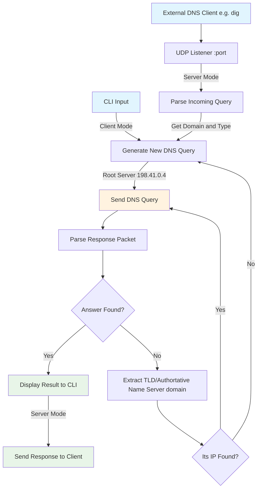

# GoLookup

A DNS client and server implemented in Go.   

Supports `A`, `MX`, `CNAME`, `TXT`, and `NS` record types.  

Compliant with [RFC 1035](https://datatracker.ietf.org/doc/html/rfc1035).

## Architecture



## Example Usage

```
$ go run ./cmd -h
usage:
    golookup [domain] [A|NS|MX|CNAME|TXT]
    golookup serve --port=<port-number>
```

```
$ go run ./cmd serve --port=9999 &
[1] 25685
$ dig @127.0.0.1 -p 9999 example.com NS
Querying: 198.41.0.4
Received Name Server for "com": "l.gtld-servers.net"
Received "l.gtld-servers.net" IP: "192.41.162.30"
Querying: 192.41.162.30
Received Name Server for "example.com": "b.iana-servers.net"
name server IP not found in packet
starting new query for: b.iana-servers.net
Querying: 198.41.0.4
Received Name Server for "net": "m.gtld-servers.net"
Received "m.gtld-servers.net" IP: "192.55.83.30"
Querying: 192.55.83.30
Received Name Server for "iana-servers.net": "a.iana-servers.net"
Received "a.iana-servers.net" IP: "199.43.135.53"
Querying: 199.43.135.53
new query done, found "b.iana-servers.net" IP: "199.43.133.53"
Querying: 199.43.133.53

; <<>> DiG 9.18.30-0ubuntu0.24.04.2-Ubuntu <<>> @127.0.0.1 -p 9999 example.com ns
; (1 server found)
;; global options: +cmd
;; Got answer:
;; ->>HEADER<<- opcode: QUERY, status: NOERROR, id: 55664
;; flags: qr; QUERY: 1, ANSWER: 2, AUTHORITY: 0, ADDITIONAL: 0

;; QUESTION SECTION:
;example.com.                   IN      NS

;; ANSWER SECTION:
example.com.            86400   IN      NS      a.iana-servers.net.
example.com.            86400   IN      NS      b.iana-servers.net.

;; Query time: 909 msec
;; SERVER: 127.0.0.1#9999(127.0.0.1) (UDP)
;; WHEN: Fri Sep 12 15:57:06 EEST 2025
;; MSG SIZE  rcvd: 115
```

## TODO

- [ ] Add inverse queries support.
- [ ] Improve error handling.
- [ ] Support `TXT` records in server mode.